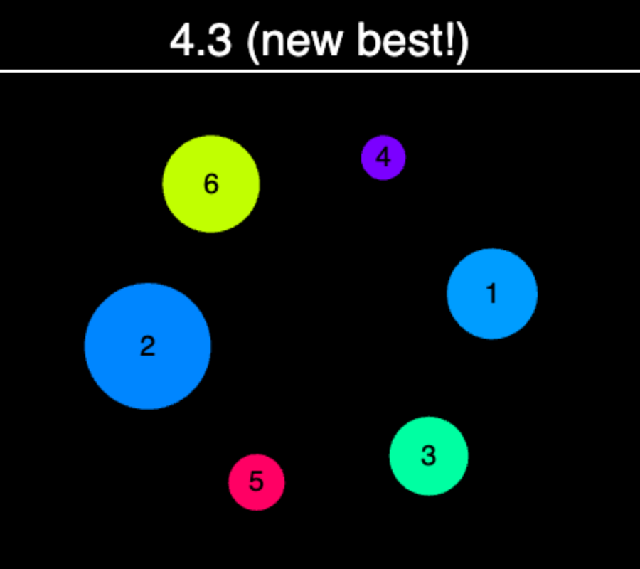
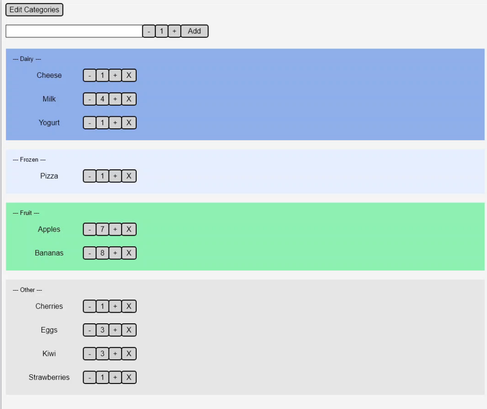

# CS349-User-Interfaces

This repository consists of readings and assignments from **CS349 - User Interfaces** a module I took during the Winter 2025 term, from the faculty of **Mathematics & Computer (MC)** at the
**_University of Waterloo_ (UWaterloo)**.

## Assignments

### General Restrictions

1. Your development environment must conform to the setup and versions specified in A0 and it must use the standard Vite folder structure (see A0 and examples in lecture).

2. You must use TypeScript. Your code must be set up to run with Vite using its default settings in `tsconfig.json`.

3. You must provide your TypeScript source code under `src/`. Do not submit a build/ directory with the transpiled and bundled files (if you do, the TAs will ignore it).

4. Your index.html file must only have a single element in the body, the `script` element to load your module for Vite to run.

5. You cannot include or import modules or packages other than Vite, SimpleKit, and your own modules.

> There should only be one `script` tag in your index.html to load your main.ts module.

> You may not run `npm install <something>` to add any other npm packages.

6. You can only draw into the single graphics context and canvas provided by SimpleKit.

7. You may not use any `style` tags, CSS files, or CSS features like gradients or animations.

8. You may not add any HTML elements to the DOM (either directly in your `index.HTML`, or added through code), and you cannot modify any elements in the DOM. For example, you cannot use DOM methods like `createElement`, `getElementById`, `querySelector`, `appendChild`, `setProperty`, etc.

9. You can not use any method on these DOM objects: `document`, `window`, or `screen`. SimpleKit provides the canvas size in a `resize` event and in the graphics context.

10. You may only use SimpleKit generated events (ie: `setSKEventListener`, `addSKEventTranslator`, `SKKeyboardEvent`, `SKMouseEvent`, `SKResizeEvent`, `SKEvent`). You may not use any DOM events like `MouseEvent` or event related DOM methods like `addEventListener`.

11. You may not use the `Path2D` interface in the Canvas API

12. You may not use the `isPointInPath` or `isPointInStroke` methods of the CanvasRenderingContext2D

13. You may not use JavaScript or HTML/DOM timers like `setInterval`, `setTimeout`, or `requestAnimationFrame`.

### A1 - CANVAS

#### Synopsis

> You’ll implement an carnival-inspired aim training game. Numbered targets placed in random order around a circle rotate and dilate in size. You click on them in order as fast as you can, and try to beat your best time. You can adjust the number and size of targets using keyboard shortcuts. Pressing “c” is a cheat to automatically click on the next target. Finally, there are some animated effects for click feedback.



#### Required Functionality

Each item is worth 2 marks, and they are roughly ordered by difficulty. The final items are more challenging. Study the video to see these requirements demonstrated.

You are to implement a game in which players must click on a series of spinning circles as quickly as possible. Oftentimes, games consist of several modes, such as, setup play, or end, with clear actions for transitioning between these modes. This game here is no different, so make sure to incorporate modes into your implementation.

> Assume the browser canvas size is at least 450 px (w) x 400px (h). (previously this was ambiguous as to which dimension was width and height)

| Point | Details                                                                                                                                                                                                                                                                                                                                                                                                                                                                                                                                                         |
| :---: | :-------------------------------------------------------------------------------------------------------------------------------------------------------------------------------------------------------------------------------------------------------------------------------------------------------------------------------------------------------------------------------------------------------------------------------------------------------------------------------------------------------------------------------------------------------------- |
|  1.   | When the app starts, that game is in `setup` mode. The background is `black`. There is `2px` thick horizontal white line `50px` below the top of the canvas. The line fully spans the width of the canvas.                                                                                                                                                                                                                                                                                                                                                      |
|  2.   | There is a text message, initially `click target 1 to begin`. The message font is white and `24px sans-serif`.                                                                                                                                                                                                                                                                                                                                                                                                                                                  |
|  3.   | The text message is horizontally centred in the canvas, and vertically centred in the space between the top of the canvas and the horizontal line.                                                                                                                                                                                                                                                                                                                                                                                                              |
|  4.   | When the browser is resized, the location of the text message adjusts to maintain this horizontal and vertical alignment.                                                                                                                                                                                                                                                                                                                                                                                                                                       |
|  5.   | In the area below the white line, there are six circular targets, each having a random radius between `15px` and `45px`.                                                                                                                                                                                                                                                                                                                                                                                                                                        |
|  6.   | The six circular targets are themselves arranged in a circular pattern, with equal distances (i.e., angles) between them. The centre of this circular pattern of targets is itself horizontally and vertically centred in the space below the white line.                                                                                                                                                                                                                                                                                                       |
|  7.   | Targets will be labelled sequentially from 1 to 6 (see #12), with labels centred in the target. The label font is black and `20px sans-serif`. At the beginning, however, only the label of Target 1 is visible.                                                                                                                                                                                                                                                                                                                                                |
|  8.   | The fill colour of Target 1 is `white`, which indicates that it is the next target to click on. All other targets are filled with `darkgrey`.                                                                                                                                                                                                                                                                                                                                                                                                                   |
|  9.   | When the browser is resized, the pattern of targets remains as large as possible and centred as described in #6 (see video). This means that the target location might shift, but all other features (overall target order and layout) remain the same.                                                                                                                                                                                                                                                                                                         |
|  10.  | Pressing the space key in `setup` mode randomizes the order of targets within the circular pattern.                                                                                                                                                                                                                                                                                                                                                                                                                                                             |
|  11.  | When in `setup` mode, clicking on Target 1 changes the mode to `play`. The text message at the top (see #2) changes to display a stopwatch timer. The timer displays seconds to 1 decimal place, such as `1.2`. It starts from 0.0, then continually counts up the time since Target 1 was clicked.                                                                                                                                                                                                                                                             |
|  12.  | When Target 1 is clicked, its fill colour changes such that it is assigned a random hue value (see #24). Target 2’s label is revealed and its fill colour turns `white`, indicating that it is the next target to be clicked. Then clicking on Target 2 changes its fill colour, Target 3’s label is revealed, and its fill colour turns `white`. This continues until all targets have been clicked on. The targets must be clicked in order. Clicking on the wrong target or clicking on no target (e.g., the background) does not change the current target. |
|  13.  | Clicking on the wrong target or on no target causes an error. An error is shown by turning the app background `darkred` from `mousedown` to the next `mouseup`.                                                                                                                                                                                                                                                                                                                                                                                                 |
|  14.  | In `play` mode, the targets slowly rotate in a clockwise direction. The initial rate of rotation is 5 degrees per second.                                                                                                                                                                                                                                                                                                                                                                                                                                       |
|  15.  | In `play` mode, the target radii periodically dilate between `15px` and `45px`. The dilation phase length is 3.6 s, i.e., it takes 3.6 for a target to transition from `15px` to `45px` and back to `15px`. The target dilations are not in phase with one another (see video).                                                                                                                                                                                                                                                                                 |
|  16.  | When the last target has been clicked, the timer stops with the final time displayed. The mode changes to `end`.                                                                                                                                                                                                                                                                                                                                                                                                                                                |
|  17.  | If the final time is faster than the previous best time, the message displays `(new best!)` to the right of the time. Otherwise the best time is shown to the right of the final time, for example, `(best: 1.2)`.                                                                                                                                                                                                                                                                                                                                              |
|  18.  | When in end mode, pressing the space key changes back to `setup` mode.                                                                                                                                                                                                                                                                                                                                                                                                                                                                                          |
|  19.  | When in `setup mode`, the number of targets can be increased by 1 by pressing the `]` key and decreased by 1 by pressing `[`. The minimum and maximum number of targets are 3 and 8 respectively. The pattern of targets updates immediately, revealing the new first target position.                                                                                                                                                                                                                                                                          |
|  20.  | When in `setup` mode, the rotation speed can be decreased by 1 degree / second by pressing the `{` key (i.e., “shift” + `[`) and increased by 1 degree / second by pressing `}`. The minimum and maximum rotation speeds are 1 degree / second and 10 degrees / second respectively. The target order and orientation along the circular pattern does not change.                                                                                                                                                                                               |
|  21.  | When the mouse cursor is over any target, the target is outlined with a 3px `lightblue` stroke.                                                                                                                                                                                                                                                                                                                                                                                                                                                                 |
|  22.  | In `play` mode, when the mouse cursor is over the correct target and the mouse button is pressed down, a `3px yellow` circle with a radius of `15px` appears at the cursor location.                                                                                                                                                                                                                                                                                                                                                                            |
|  23.  | The yellow circle from #22 is smoothly animated outward over about one-third of a second from a radius of `15px` to a radius of `45px`. The circle is in front of other targets.                                                                                                                                                                                                                                                                                                                                                                                |
|  24.  | The fill color of each target, once clicked, consists of a randomly assigned hue (0 – 360), 100% saturation, and 50% lightness.                                                                                                                                                                                                                                                                                                                                                                                                                                 |
|  25.  | If the mouse button is held down without moving more than 10 px for at least 1 second, a SimpleKit `SKMouseEvent` with type `longclick` is triggered when the mouse button is released. In your global event listener callback function, log the `SKMouseEvent` object for the `longclick` to the console to show that it is working. You need to create a `longClickTranslator` object and add it to SimpleKit using `addSKEventTranslator`.                                                                                                                   |
|  26.  | When in `play` mode, a `longclick` event resets all targets and returns to `setup` mode. The `longclick` can be performed anywhere in the canvas.                                                                                                                                                                                                                                                                                                                                                                                                               |
|  27.  | When in `setup` or `play` mode, pressing the `c` key is a cheat to automatically “click” the next target.                                                                                                                                                                                                                                                                                                                                                                                                                                                       |
|  28.  | Upon pressing the `c` to advance targets, there is no mouseover lightblue ring (#21) and no mousedown yellow circle (#22-23), but all other behaviour is the same as a mouse click.                                                                                                                                                                                                                                                                                                                                                                             |

#### Submission

The `a1/` folder should have the following directory:

```shell
a1/
├── a1-canvas/
│ ├── node_modules
│ ├── public
│ ├── src/
│ │ └── main.ts          // main logic of where A1 is at
│ ├── .gitignore
│ ├── index.html
│ ├── package-lock.json
│ ├── package.json
│ └── tsconfig.json
├── .gitignore
└── README.md
```

Inside the folder `a1/` there includes a `README.md` which states how to launch the assignment, it also includes the following points:

- known bugs and workarounds
- describing use of AI tools like CoPilot or code from other sources
- assumptions you made after clarifying something on Piazza (provide a link to the Piazza post)

### A2 - Imperative UI

#### Synopsis

> Your task is implementing a shopping list application.



#### Required Functionality

Each item is worth 2 marks, and they are roughly ordered by difficulty. The final items are more challenging. Study the video to see these requirements demonstrated.

> Assume the browser canvas size is at least 450 x 400px.

Your implementation must follow the Model-View-Controller or MVC architecture; you are, however, allowed to integrate the controller into the view.

Shopping items have two properties: their name and their category. Categories have two properties: their name and their colour. While it is up to you on which items and categories are pre-defined in your implementation, there must be a category `Other` for practical reasons (see #11 and #13); its colour should be “hsl(0, 0%, 90%)”. For reference, for the sample video, we pre-defined the categories `Dairy` (hsl(220, 75%, 75%)), `Frozen` (hsl(220, 90%, 95%)), and `Fruit` (hsl(140, 75%, 75%)), in addition to `Other`. We also pre-defined the items `Apples` (`Fruit`), `Bananas` (`Fruit`), `Cheese` (`Dairy`), `Ice cream` (`Frozen`), `Milk` (`Dairy`), `Pizza` (`Frozen`), and `Yogurt` (`Dairy`). [Update (Feb-11): we recommend pre-defining 4~6 categories and 4~6 items]

The main UI contains three vertically stacked sections: a “settings”-section, an “add”-section, and a “list”-section.

| Point |     Section     | Details                                                                                                                                                                                                                                                                                                                                                                                                                                                                                                                                                                                                                                                                                                     |
| :---: | :-------------: | :---------------------------------------------------------------------------------------------------------------------------------------------------------------------------------------------------------------------------------------------------------------------------------------------------------------------------------------------------------------------------------------------------------------------------------------------------------------------------------------------------------------------------------------------------------------------------------------------------------------------------------------------------------------------------------------------------------- |
|  1.   |    Settings     | The “Settings”-section contains a single button labelled “Edit Categories”. The button is 125 wide. The style for this and all other widgets may follow SimpleKit’s default style.                                                                                                                                                                                                                                                                                                                                                                                                                                                                                                                          |
|  2.   |       Add       | The “add-item”-section contains three horizontally aligned widgets: an empty text field for free-form text input, a “quantity widget” with quantity set to “1” (see #8), and a button for adding an item to the shopping list labelled “Add” (“add-button”).                                                                                                                                                                                                                                                                                                                                                                                                                                                |
|  3.   |       Add       | The text field has an initial width of 300. When the text typed into the text field exceeds its available width, the text field dynamically grows in width. Likewise, if the content of the text fields becomes shorter again after deleting characters, the text field dynamically shrinks in width, down to a minimum width of `300`.                                                                                                                                                                                                                                                                                                                                                                     |
|  4.   |       Add       | The text in the text field cannot have leading whitespace, such as space (' '). For example, it should be impossible to type in the string `" Kiwi"`.                                                                                                                                                                                                                                                                                                                                                                                                                                                                                                                                                       |
|  4.   |       Add       | You must create a new “quantity widget”. This widget behaves similar to a “Number Abstract Widget” in that it allows to input number values within a certain range. The lower boundary of this widget is `1`, and its upper boundary is 99. The widget consists of three horizontally aligned buttons. The outer ones are labelled “-” and “+” respectively and allow to decrease and increase the value of the widget by one within the value’s boundaries (similar to a spinner). The button in the centre displays the current value, and clicking on the button resets the value to a default value, which is 1 for this particular quantity widget. All three buttons should be roughly square-shaped. |
|  5.   |       Add       | Clicking on the “add-button” adds a new item (as identified by its name in the text field and its quantity in the quantity-widget) to the shopping list. If the name is the empty string (`""`) or if an item with the same name already exists on the shopping list, no item is added to the shopping list, i.e., the shopping list remains unchanged.                                                                                                                                                                                                                                                                                                                                                     |
|  6.   |       Add       | Pressing `[Enter]` while focus is on the text field results in the same behaviour as clicking on the “add-button” (see #9).                                                                                                                                                                                                                                                                                                                                                                                                                                                                                                                                                                                 |
|  7.   |       Add       | After an item is added to the shopping list, it must appear in the correct category section (see #13). If the item is neither from the pre-defined list of items (see #2) nor has been added (and removed) previously, it might not have a category associated with it. In this case, it should be in the category “Other” (see #2).                                                                                                                                                                                                                                                                                                                                                                        |
|  8.   |       Add       | After pressing the add-button, the text field is cleared and the quantity is reset to `1`.                                                                                                                                                                                                                                                                                                                                                                                                                                                                                                                                                                                                                  |
|  9.   |      List       | The shopping list consists of multiple horizontally stacked views, each representing a category of shopping items. You may re-use the `stackCol`-layout from the lecture’s demo code. Please be aware that the canvas does not scroll: when having too many items in the shopping list, categories might disappear at the bottom of the canvas. This is expected behaviour.                                                                                                                                                                                                                                                                                                                                 |
|  10.  |      List       | A category section has its name in the top-left corner, printed with three leading and trailing dashes (`'-'`), in `"10pt sans-serif"`. Each category must have a somehow distinctive background colour.                                                                                                                                                                                                                                                                                                                                                                                                                                                                                                    |
|  11.  |      List       | The name is succeeded by a vertical and alphabetically sorted list of all shopping items in that category.                                                                                                                                                                                                                                                                                                                                                                                                                                                                                                                                                                                                  |
|  12.  |      List       | Each shopping item is represented by three horizontally aligned widgets: a label with the name of the item; a quantity-widget, indicating the current quantity of the item (see #8), and a remove button. The label has a width of `150`, and its text has an alignment of `"centre"`.                                                                                                                                                                                                                                                                                                                                                                                                                      |
|  13.  |      List       | The maximum width of each label is `150`; if the item name is too long to be fully displayed, it is cut of and tail-ended with three dots (`"..."`).                                                                                                                                                                                                                                                                                                                                                                                                                                                                                                                                                        |
|  14.  |      List       | The remove button is labelled `'X'`. The button should have the same size as the buttons in the quantity widget. Pressing the button removes the current item from the shopping list.                                                                                                                                                                                                                                                                                                                                                                                                                                                                                                                       |
|  15.  |      List       | Double-clicking anywhere on the item, except the quantity widget and the remove button, marks the item as “bought”. Bought items are represented with a dark background (e.g., `rgb(91, 91, 91)`). Performing another double-click will “un-buy” the item, i.e., remove the background indicating “bought”.                                                                                                                                                                                                                                                                                                                                                                                                 |
|  16.  |      List       | If an item is marked as “bought”, the quantity widget should not be visible. The remove button should remain visible and remain in its previous location.                                                                                                                                                                                                                                                                                                                                                                                                                                                                                                                                                   |
|  17.  | Settings-Screen | Pressing the “Edit Categories”-button replaces the current UI with a new view (see #22).                                                                                                                                                                                                                                                                                                                                                                                                                                                                                                                                                                                                                    |
|  18.  | Settings-Screen | At the top of this view are a return button and a quantity widget, which represents the number of columns in the grid view (see #26). The minimum value of the quantity is `1`, the maximum is equal to the number of items, and the default value is the smallest of `3` and the number of items.                                                                                                                                                                                                                                                                                                                                                                                                          |
|  19.  | Settings-Screen | Clicking on the return button replaces the current UI with the main UI (see #1).                                                                                                                                                                                                                                                                                                                                                                                                                                                                                                                                                                                                                            |
|  20.  | Settings-Screen | Below that is a grid view of all pre-defined and added items in alphabetical order (left-to-right, top-to-bottom). Each item is represented by its name and a “radio group widget” (see #29) representing the item’s category.                                                                                                                                                                                                                                                                                                                                                                                                                                                                              |
|  21.  | Settings-Screen | The maximum width of each label is `150`; if the item name is too long to be fully displayed, it is cut of and tail-ended with three dots (`"..."`) (see #17).                                                                                                                                                                                                                                                                                                                                                                                                                                                                                                                                              |
|  22.  | Settings-Screen | You must create a grid view. This grid view should receive the number of columns as parameter. In a grid view, all columns have the same width, and all rows have the same height. The width and height here are determined by the maximum width and maximum height of the elements displayed in the grid view.                                                                                                                                                                                                                                                                                                                                                                                             |
|  23.  | Settings-Screen | Within each grid, elements should horizontally aligned to the right, and vertically aligned to the top, i.e., the top-right corner of each element should be located at the top-right corner of their grid cell.                                                                                                                                                                                                                                                                                                                                                                                                                                                                                            |
|  24.  | Settings-Screen | The grid view must respond dynamically to a change in column count via the quantity widget (see #22). Depending on the number of items and columns, items might disappear to the [Update (Feb-21): left right] or at the bottom of the canvas. This is expected behaviour.                                                                                                                                                                                                                                                                                                                                                                                                                                  |
|  25.  | Settings-Screen | You must create a “radio group widget”. A radio group widget contains an arbitrary number of a combination of radio buttons and labels, stacked horizontally, and surrounded by a border. Only one radio button can be selected at any point, and selecting a new radio button de-selects the previously selected one.                                                                                                                                                                                                                                                                                                                                                                                      |
|  26.  | Settings-Screen | The radio group is initialized so that the current category for each item is selected.                                                                                                                                                                                                                                                                                                                                                                                                                                                                                                                                                                                                                      |
|  27.  | Settings-Screen | Any changes to an items’ category is immediate, i.e., there is not “Confirm” or “Safe” button that must be clicked in order to update an item’s category.                                                                                                                                                                                                                                                                                                                                                                                                                                                                                                                                                   |

#### Submission

The `a2/` folder should have the following directory:

```shell
a2/
├── node_modules
├── public
├── src/
│   ├── addSection.ts         // contains points from "Add" section
│   ├── layout.ts             // code for application layout
│   ├── listSection.ts        // contains points from "List" section
│   ├── main.ts               // main logic where A2 is at
│   ├── model.ts              // code of mode in MVC
│   ├── observer.ts           // code for observer pattern
│   ├── radioButton.ts        // code for custom Radio Button
│   └── settingsSection.ts    // contains points from "Settings-Screen"
├── .gitignore
├── index.html
├── package-lock.json
├── package.json
├── README.md
└── tsconfig.json
```

Inside the folder `a2/` there includes a `README.md` which states how to launch the assignment, it also includes the following points:

- **a list of pre-defined categories and items**
- known bugs and workarounds
- describing use of AI tools like CoPilot or code from other sources
- assumptions you made after clarifying something on Piazza (provide a link to the Piazza post)

### A3

### A4

## Acknowledgements

These materials are an undertaking of [CS349 - User Interfaces](https://student.cs.uwaterloo.ca/~cs349/1251/index.html) course during Winter 2025 under the **MC** faculty at **UWaterloo**.

All contents of assignment solutions are credited to:  
Copyright &copy; 2025 _Vancence Ho_ &nbsp;|&nbsp; MC Exchange Student &nbsp;|&nbsp; UWaterloo

All contents of the readings and the course are credited to:  
Copyright &copy; 2025 _CS349_ &nbsp;|&nbsp; MC &nbsp;|&nbsp; UWaterloo
